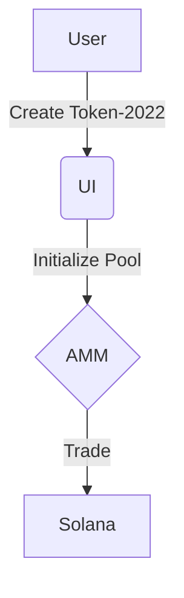
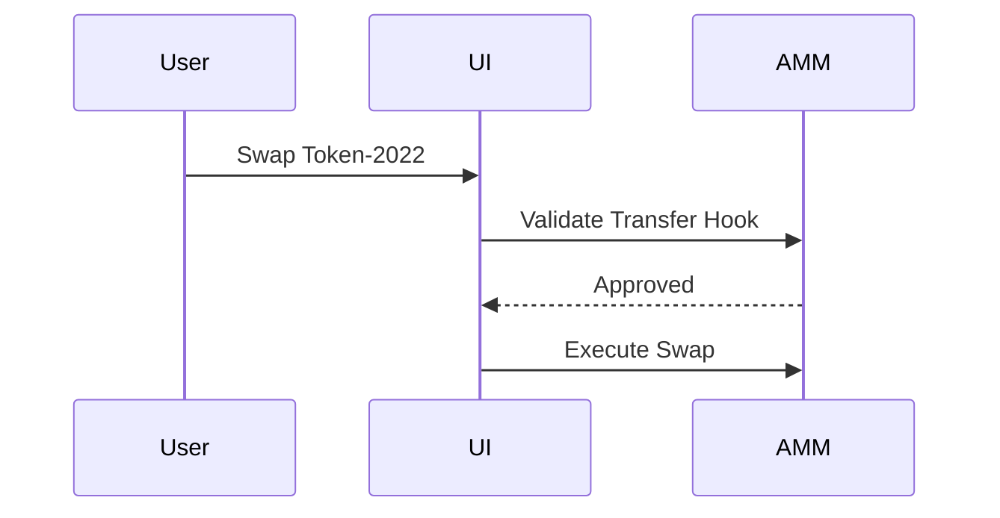

# Token-2022 AMM Integration

## Overview
This project enables trading of Token-2022 tokens with Transfer Hooks on a Solana AMM, either by extending an existing AMM (Raydium, Orca, Meteora) or building a new one. It includes a UI for creating tokens, liquidity pools, and trading, with support for whitelisted Transfer Hooks.

## Installation
### Prerequisites
- Solana CLI: `sh -c "$(curl -sSfL https://release.anza.xyz/stable/install)"`
- Rust: `curl --proto '=https' --tlsv1.2 -sSf https://sh.rustup.rs | sh`
- Node.js: Version 18 or higher
- Anchor: `cargo install --git https://github.com/coral-xyz/anchor anchor-cli --locked`

### Setup
1. Clone the repository:
   ```bash
   git clone https://github.com/your-repo/token-2022-amm.git
   cd token-2022-amm
   ```
2. Install dependencies:
   ```bash
   npm install
   ```
3. Configure Solana devnet:
   ```bash
   solana config set --url https://api.devnet.solana.com
   ```

## Usage
### Creating a Token-2022 with Transfer Hook
```rust
use anchor_lang::prelude::*;
use spl_token_2022::extension::transfer_hook::TransferHook;

#[program]
pub mod token_2022_amm {
    use super::*;
    pub fn initialize_token(ctx: Context<InitializeToken>) -> Result<()> {
        // Initialize Token-2022 with Transfer Hook
        Ok(())
    }
}
```

### Creating a Liquidity Pool
```typescript
import { createPool } from './sdk';
async function main() {
  const pool = await createPool({ token: 'TOKEN_ADDRESS', pair: 'SOL' });
  console.log(`Pool created: ${pool.address}`);
}
```

## API Reference
- `createPool(token, pair)`: Creates a SOL-token liquidity pool.
  - **Inputs**: `token` (string), `pair` (string)
  - **Output**: Pool address (string)

## Troubleshooting
- **Error**: "Transfer Hook validation failed"
  - **Solution**: Ensure the Transfer Hook program is whitelisted in the AMM configuration.

## Changelog
See [CHANGELOG.md](#changelog) for version history.

## Diagrams
### System Architecture


### Trading Flow

